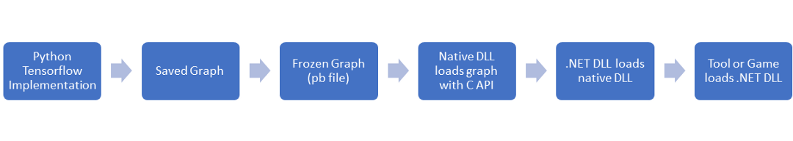
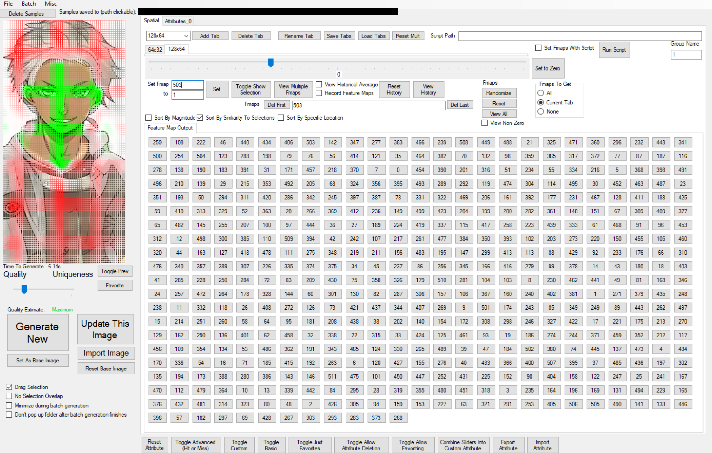
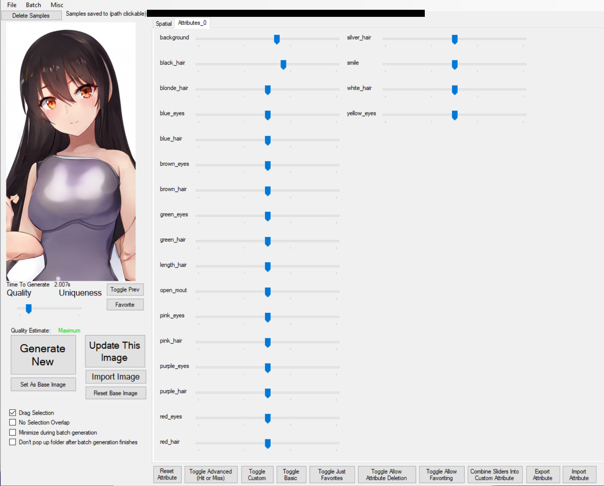

Blogs:
Introduction:
https://towardsdatascience.com/animating-ganime-with-stylegan-part-1-4cf764578e
Tutorial + link to compiled version
https://towardsdatascience.com/animating-ganime-with-stylegan-the-tool-c5a2c31379d

Important note: I would not recommend trying to build this yourself yet, I need to include better instructions and I'd like to get it working with models trained on the official StyleGAN implementation instead of just my personal one (https://github.com/nolan-dev/stylegan_reimplementation).  I'm planning on providing these updates in the next week or so.

This is a tool for interacting with images generated by a StyleGAN model.

It has 3 parts:
- TensorflowInterface: Native DLL that uses the TensorFlow C API and tensorflow.dll to interact with a frozen model
- GanTools: .NET DLL that interacts with with TensorflowInterface DLL, which can be imported into a game or GanStudio
- GanStudio: .NET EXE test harness that interacts with the GanTools DLL.

The GanStudio tool includes features such as batch generation, truncation trick slider, feature map viewing/sorting, feature map modification, saving/importing images, customizable latent vector modification, image interpolation, and animation through incremental modification of feature maps or latent values. 

All these features were added on a ad hoc basis and optimized for implementation speed, which has resulted in extremely messy UI/code unfortunately:

 
 

However, I think there is value in quickly creating interactive tools like this, I believe they can help give insight where approaches that allow slower interaction (such as running cells in a jupyter notebook) don't.  Evidence for this is pending some experimental results.

Images from a model trained on an anime dataset https://www.gwern.net/Danbooru2018
