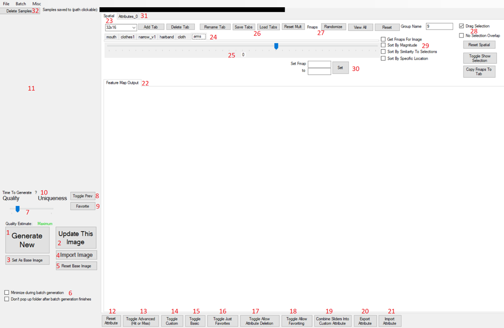

This is a tool for interacting with images generated by a StyleGAN model.

It has 3 parts:
- TensorflowInterface: Native DLL that uses C API and tensorflow.dll to interact with a frozen model
- GanTools: .NET DLL that interacts with with TensorflowInterface DLL, which can be imported into a game or GanStudio
- GanStudio: .NET EXE test harness that interacts with the GanTools DLL.

The GanStudio tool includes features such as batch generation, truncation trick slider, feature map viewing/sorting, feature map modification, saving/importing images, customizable latent vector modification, image interpolation, and animation through incremental modification of feature maps or latent values. 

All these features were added on a ad hoc basis and optimized for implementation speed, which has resulted in extremely messy UI/code unfortunately:

 

However, I think there is value in quickly creating interactive tools like this, I believe can help give insight that approaches that allow slower interaction (such as running cells in a jupyter notebook) don't.  Evidence for this pending some experimental results.